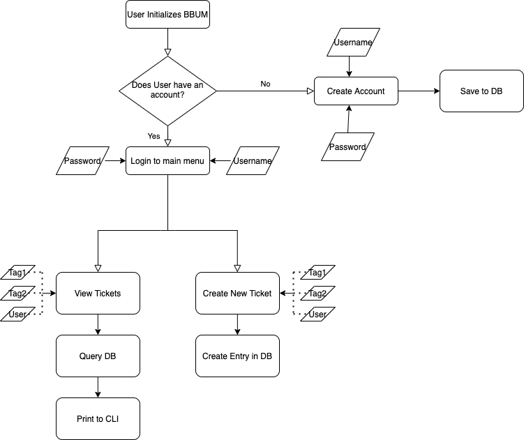

# Boring-but-Useful-Notifier

First learning project from a group of enthusiastic Python learners. The goal of the project is to create a ticketing system. Users on the platform can create tickets for issues or task items, and the tickets can interface with other software (email, calender)

## User Interface

The user interface will begin as a CLI running on a shell. The interface will allow users to:
- Make new tickets
- Edit existing tickets
- Delete existing tickets
- Send a ticket to another platform (email, calendar)

In addition, tickets will have fields for categorization, as well as a list of users that can be attached to the ticket.

## Database

The database will be used to store user accounts and passwords. There needs to be a secure method of entering and modifying data on the database (I found this [video](https://www.youtube.com/watch?v=pd-0G0MigUA&t=1104s) to be a helpful introduction). The database will also be storing tickets as well as the tags and users that can be associated with a particular ticket. 

Standard database use will be needed ([CRUD](https://www.sqlshack.com/crud-operations-in-sql-server/) operations)

## Interface to APIs

Tickets should be able to link to calendar and email software, so interfacing with the respecive APIs will be necessary. A long but basic overview to APIs is [here](https://www.youtube.com/watch?v=GZvSYJDk-us&t=2287s)

- Tickets should be able to send email notifications
- Tickets should be able to send calendar notifications
- Tickets should be able to be managed via email
- Tickets should be able to be managed via calendar

## Project Structure
Based on [this](https://docs.python-guide.org/writing/structure/) source, the following is a standard structure we may use or modify based on our needs

```
README.rst
LICENSE
setup.py
requirements.txt
sample/__init__.py
sample/core.py
sample/helpers.py
docs/conf.py
docs/index.rst
tests/test_basic.py
tests/test_advanced.py
```

## Flowchart
Work in progress for flow chart 


